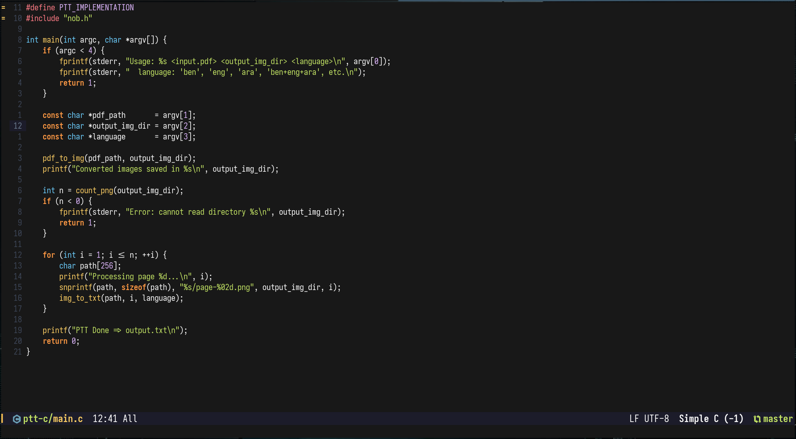

# Gruber Darker + Ayu Dark #

A blend of the [Gruber Darker](http://jblevins.org/projects/emacs-color-themes/color-theme-gruber-darker.el.html) and
[Ayu Dark](https://github.com/ayu-theme/ayu-colors) color themes.
Keeps Gruber Darker's deep `#181818` background while replacing its muted
syntax with the warm, high-contrast palette of Ayu Dark.

## Screenshot ##


# Installation #

You can do everything by your hands.

## Manual old fashioned way ##

Download the theme to your local directory. You can do it through `git
clone` command:

```
git clone https://github.com/Hadi493/gruber-darker-ayu-theme.git
```

Then add path to gruber-darker-ayu-theme to custom-theme-load-path list —
add the following to your emacs config file somewhere (.emacs,
init.el, whatever):

```
(add-to-list 'custom-theme-load-path
             "/path/to/gruber-darker-ayu-theme/")
```

Use `M-x load-theme RET gruber-darker-ayu RET` to change your current theme.

# Contribution #

Gruber Darker + Ayu Dark is an awesome theme. But it has a lack of support for
many good modes. I add color faces only for modes I use. If you like
this theme and use a mode that looks very bad with it, feel free to
add appropriate color faces (see file gruber-darker-ayu-theme.el) and send
me a pull request.

Thanks.
