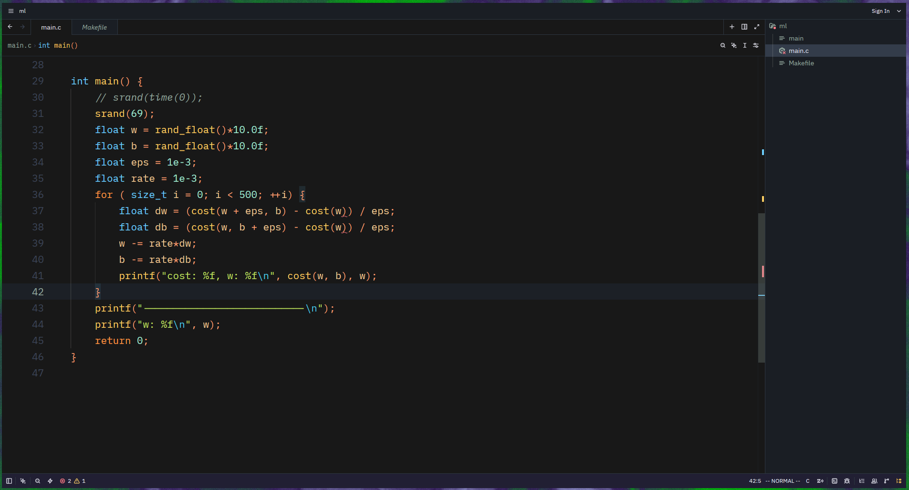
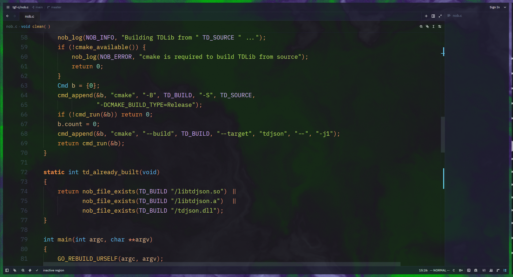
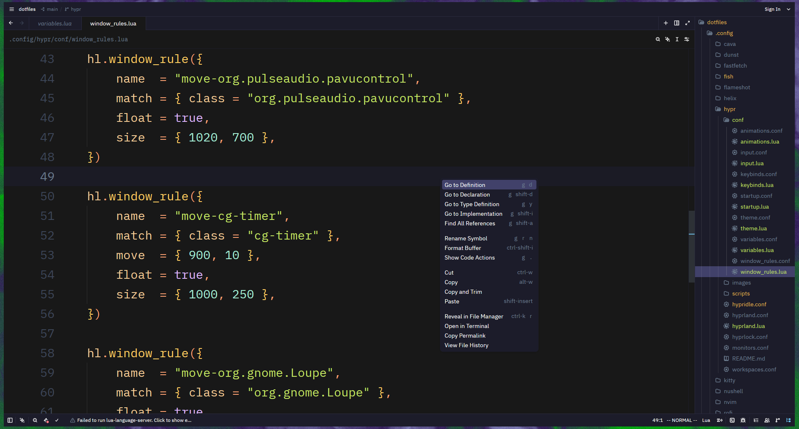

# Gruber Darker + Ayu Dark

A color theme for the [Zed editor](https://zed.dev), blending the deep
`#181818` background of [Gruber Darker](http://jblevins.org/projects/emacs-color-themes/color-theme-gruber-darker.el.html)
with the warm, high-contrast syntax palette of [Ayu Dark](https://github.com/ayu-theme/ayu-colors).

## Screenshots





## Installation

Copy the theme file into your Zed themes directory:

```sh
mkdir -p ~/.config/zed/themes
cp gruber-darker-ayu.json ~/.config/zed/themes/
```

Restart Zed, then select **Gruber Darker Ayu** in the theme picker
(`cmd-k cmd-t` on macOS, `ctrl-k ctrl-t` on Linux/Windows).

## Emacs version

The original Emacs theme lives on the `master` branch as
`gruber-darker-ayu-theme.el`.

## Development

To validate the theme file:

```sh
python3 -m json.tool gruber-darker-ayu.json > /dev/null
```

## License

[GPL-3.0](LICENSE) © Hadi Alam.
